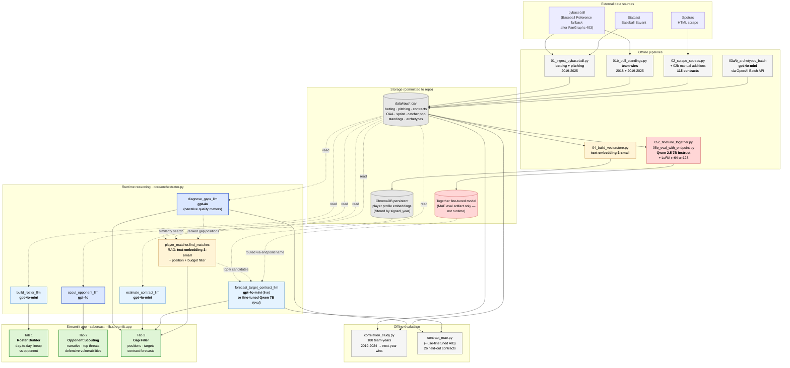

# Sabercast Architecture

Every box is labeled with the **specific model or store** doing the work. The
diagram supports the final-report section on Technical Depth (35 % of grade)
by making the LLM/agentic role explicit — which model runs in which step, and
how data flows from raw ingest through embedding, retrieval, and reasoning out
to the three user-facing tabs.

GitHub renders this Mermaid block natively. To export to PNG for the Word
deliverable, screenshot the rendered block or run
`npx -p @mermaid-js/mermaid-cli mmdc -i docs/architecture_diagram.md -o docs/architecture_diagram.png`.

## Reading guide for the grader

**Color legend**

| Color | Component type |
|---|---|
| 🟦 Dark blue | `gpt-4o` reasoning calls (narrative quality matters more than cost: gap diagnostic, opponent scouting) |
| 🟦 Light blue | `gpt-4o-mini` reasoning calls (cost-sensitive structured JSON output: contract estimates, target forecasts, roster builder) |
| 🟨 Yellow | OpenAI embedding work (`text-embedding-3-small`) — both the offline Batch API archetype classification and the runtime RAG retrieval |
| 🟥 Red | Together AI fine-tuned model (`Qwen/Qwen2.5-7B-Instruct` + LoRA r=64 α=128). **Eval only**, not runtime — the dedicated endpoint cold-start of ~4 min is unsuitable for an interactive Streamlit app |
| ⬜ Gray | Pipelines and storage |
| 🟩 Green | User-facing Streamlit tabs |

**Determinism guarantees on every reasoning call**

- `temperature=0`
- `seed=42` (where the model supports it)
- `response_format={"type": "json_object"}` for all structured-output calls
- Together inference uses `temperature=0` (response_format and seed are omitted because the fine-tuned model emits JSON natively from training and not all Together hosts honor those parameters)

**No-look-ahead enforcement**

- Contracts filtered by `signed_year <= evaluation_year` at every retrieval point
- Vector-store profiles filtered by `signed_year <= evaluation_year` in `player_matcher.find_matches`
- Fine-tune training data filtered per-row: each example's comparable pool only contains contracts with `signed_year < target_signed_year`
- Held-out evaluation set (26 contracts) shares the `random.seed(42)` selection between `eval/contract_mae.py` and `pipelines/05a_finetune_submit.py` so the same 30 indices are excluded from training and held out for scoring

**RAG flow specifically**

1. User selects a team + position gap on the Gap Filler tab
2. `diagnose_gaps_llm` (gpt-4o) returns a ranked list of gap positions with reasoning
3. For each gap, the reasoning text is embedded via `text-embedding-3-small` and used as a similarity query into the ChromaDB vectorstore
4. ChromaDB returns top-k candidates whose archetype + stats best match the gap, **filtered by position + signed_year ≤ evaluation_year**
5. Candidates pass to `forecast_target_contract_llm` (gpt-4o-mini at runtime, or the fine-tuned Qwen 7B on Together AI for the offline MAE eval)
6. The Gap Filler tab renders the gap + the top-3 candidates + per-target contract forecast

**Why the fine-tune is eval-only**

The Together-hosted Qwen 2.5 7B fine-tune (`rpeugh_302d/Qwen2.5-7B-Instruct-sabercast-contract-663bd032`) lives on a non-serverless tier of Together's account. Inference requires deploying a dedicated 2× H100 endpoint at $0.22/min, with a ~4 min cold-start. That latency profile is fundamentally incompatible with the interactive Streamlit-Cloud UX (target end-to-end response ≤ 12 s). The fine-tune therefore serves as a published held-out MAE benchmark (BUILD_LOG Entry 15) rather than a runtime path. The runtime forecast call uses `gpt-4o-mini` as the deployed forecaster; the `use_finetuned` kwarg on `forecast_target_contract_llm` is the routing seam that lets the offline eval swap in the fine-tune.

**Vendor-risk note (full story in BUILD_LOG Entries 14 + 15)**

The architecture had to absorb three mid-build LLM-platform constraints:

1. May 31: OpenAI deprecated self-serve fine-tuning for this organization
2. June 1 am: Together moved smaller Llama / Mistral models off the serverless tier
3. June 1 (later): Together flagged custom fine-tunes as non-serverless on this account tier, forcing dedicated-endpoint deployment with `endpoint.name` (not `model_output_name`) as the routing key

All three are documented as honest findings in the report's "Vendor risk" section. The runtime architecture above is the version that survived all three.
